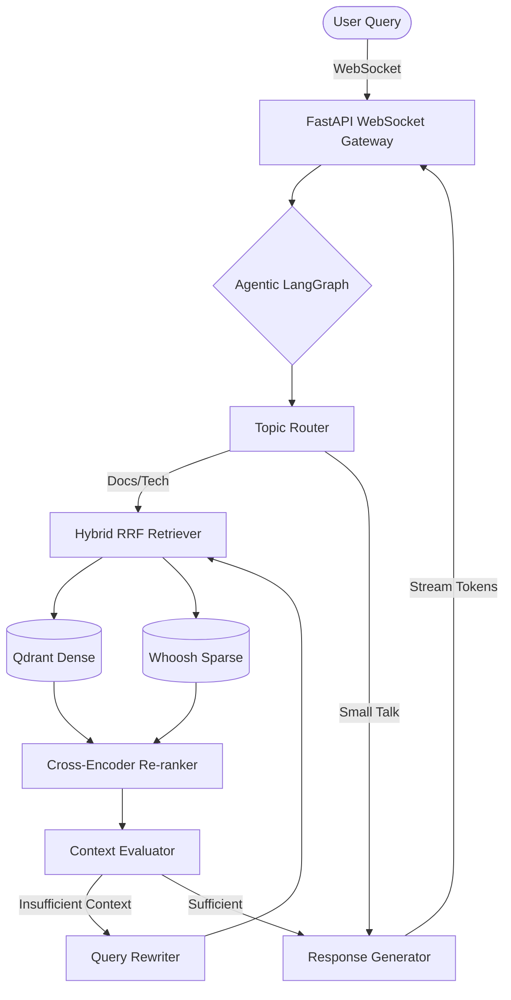

<div align="center">
  
  
  
  

  <br />
  <h1>🧠 Intelligent Documentation Navigator</h1>
  <p><strong>Agentic Hybrid RAG System for Complex Knowledge Retrieval</strong></p>
</div>

The **Intelligent Documentation Navigator** is an advanced Retrieval-Augmented Generation (RAG) platform. Unlike simple vector-search systems, this application employs an **agentic loop** to dynamically route queries, evaluate retrieved context, and rewrite search terms if the documentation isn't found. It marries this intelligence with a robust **Hybrid Retrieval Pipeline** and serves it through a real-time **glassmorphic React UI**, allowing users to visually watch the agent "think" in real-time.

---

## ✨ Key Features

- **Agentic Reasoning Loop:** Powered by LangGraph, the AI dynamically decides how to fulfill a query. It self-evaluates retrieved chunks, rewrites failing queries to retry with broader terms, and falls back gracefully.
- **Multi-Stage Hybrid Search:** Fuses the semantic understanding of high-dimensional dense vectors (Qdrant) with precise exact-keyword matching (Whoosh) using **Reciprocal Rank Fusion (RRF)**. Top results are forcibly re-ranked by an aggressive Cross-Encoder model.
- **Real-Time Streaming Protocol:** Uses FastAPI WebSockets to stream asynchronous LLM tokens back to the client interface word-by-word with zero blocking.
- **Transparent Citations:** Automatically attaches exact source file paths and context references to the final LLM response as hoverable UI chips.
- **Premium Glassmorphic Interface:** A heavily polished, dark-themed React + Vite application featuring fluid micro-animations and a live "Thought Process" tracking dashboard mapping the state machine (Routing → Retrieving → Evaluating → Generating).

---

## 🏗️ Architecture



### Agentic Loop Components

- **Topic Router:** Identifies the intent of the query. If it's "Small Talk," it bypasses retrieval. If it's "Docs Search," it triggers the hybrid pipeline.
- **Hybrid RRF Retriever:** Performs parallel searches in Qdrant (semantic) and Whoosh (keyword) and merges them using Reciprocal Rank Fusion.
- **Cross-Encoder Re-ranker:** A second-stage model that scores the top RRF results for precise relevance.
- **Context Evaluator:** A reasoning step that determines if the retrieved chunks actually answer the query.
- **Query Rewriter:** If context is insufficient, this node uses the LLM to hallucinate better search terms and retries the loop.

---

## 🛠️ Technology Stack

### Backend Engine
- **Framework:** FastAPI, Uvicorn, Python 3.12
- **Agent Orchestration:** LangChain, LangGraph
- **Vector/Dense Database:** Qdrant (Dockerized)
- **Sparse Database:** Whoosh
- **Models:** OpenAI (GPT-4o / GPT-4o-mini), `sentence-transformers` (all-MiniLM-L6-v2, ms-marco-MiniLM-L-6-v2)

### Frontend GUI
- **Framework:** React 19, TypeScript, Vite
- **Styling:** Premium Vanilla CSS Modules (Glassmorphism design language)
- **Networking:** Native HTML5 WebSockets

---

## 🚀 Getting Started

### Prerequisites
- Node.js `v20+`
- Python `3.10+`
- Docker & Docker Compose
- OpenAI API Key

### 1. Launching the Backend

1. **Spin up Qdrant Vector Database:**
   ```bash
   docker-compose up -d qdrant
   ```

2. **Setup the Python Environment:**
   ```bash
   python -m venv .venv
   # Windows
   .\.venv\Scripts\activate
   # macOS/Linux
   source .venv/bin/activate
   
   pip install -r backend/requirements.txt
   ```

3. **Configure Environment Variables:**
   Create a `.env` file in the root directory:
    ```env
    ENVIRONMENT=development
    OPENAI_API_KEY=your_openai_api_key_here
    QDRANT_URL=http://localhost:6333
    REASONING_MODEL=gpt-4o-mini
    GENERATION_MODEL=gpt-4o
    REDIS_HOST=localhost
    ```

#### Environment Variables Detail

| Variable | Description | Default |
|----------|-------------|---------|
| `OPENAI_API_KEY` | Your OpenAI API key (Required) | - |
| `QDRANT_URL` | URL for the Qdrant vector database | `http://localhost:6333` |
| `REASONING_MODEL` | LLM used for routing and evaluation | `gpt-4o-mini` |
| `GENERATION_MODEL` | LLM used for final response synthesis | `gpt-4o` |
| `REDIS_HOST` | Host for Redis caching | `localhost` |
| `ENVIRONMENT` | Deployment environment (development/production) | `development` |

4. **Run the API & WebSocket Server:**
   ```bash
    uvicorn backend.main:app --host 0.0.0.0 --port 8000 --reload
    ```

### 2. Ingesting Your Documents

Before querying, you must populate the vector and sparse databases with your documentation.

1. **Prepare your data:** Place your PDF, Markdown, or Text files in a directory (e.g., `data/`).
2. **Run the indexing CLI:**
   ```bash
   # Make sure your virtual environment is active
   python -m backend.indexing.cli --dir ./path/to/your/docs --chunk-size 1000 --chunk-overlap 200
   ```
   This will:
   - Parse files into logical sections.
   - Generate embeddings and store them in **Qdrant**.
   - Build a keyword index in **Whoosh**.

### 3. Launching the Frontend

Open a new terminal window to start the Vite UI.

```bash
cd frontend
npm install
npm run dev
```

The application will be running at **`http://localhost:5173`**. Due to the Vite proxy configuration, the frontend will automatically tunnel WebSocket requests to the `8000` backend port avoiding CORS issues.

---

## 📂 Project Structure

```text
.
├── backend/
│   ├── agents/           # LangGraph state machine, Routers, Evaluators, Rewriters
│   ├── api/              # FastAPI Routers, WebSocket Endpoints, Pydantic Schemas
│   ├── generation/       # LLM streaming logic, Strict Prompts
│   ├── indexing/         # Multi-format Document Loaders (PDF, MD), Whoosh Indexer
│   ├── retrieval/        # Hybrid Search (Qdrant + Whoosh + CrossEncoder)
│   ├── utils/            # Shared Logging mechanism
│   └── main.py           # Application Entrypoint
├── frontend/
│   ├── src/
│   │   ├── components/   # ChatInput, ChatMessage, CitationChip, ThoughtProcess
│   │   ├── hooks/        # useWebSocket.ts
│   │   ├── App.tsx       # Main layout and message loop
│   │   ├── types.ts      # Shared TS Interfaces
│   │   └── index.css     # Global glassmorphic design tokens
│   ├── index.html        # App Shell
│   └── vite.config.ts    # Build & Proxy config
├── docker-compose.yml    # Infrastructure definitions
└── plan.md               # End-to-end multi-stage execution plan
```

---

## 🛠️ Troubleshooting

- **Qdrant Connection Refused:** Ensure the Docker container is running (`docker ps`). If using a custom port, update `QDRANT_URL` in `.env`.
- **OpenAI API Quota:** The system defaults to GPT-4o. If you hit rate limits, try switching `REASONING_MODEL` to `gpt-4o-mini`.
- **No Results Found:** Check if you've run the indexing CLI (`backend/indexing/cli.py`) on your data folder.
- **ModuleNotFoundError:** Ensure you are running commands from the root directory and your `.venv` is active.

---

## 📜 License

This project is licensed under the [MIT License](LICENSE).

<div align="center">
  <sub>Built with precision for large-scale documentation architectures.</sub>
</div>
